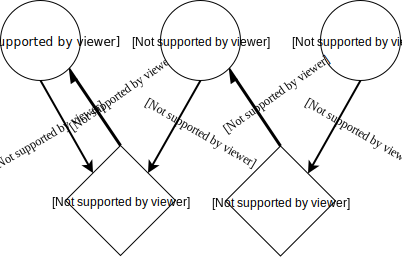
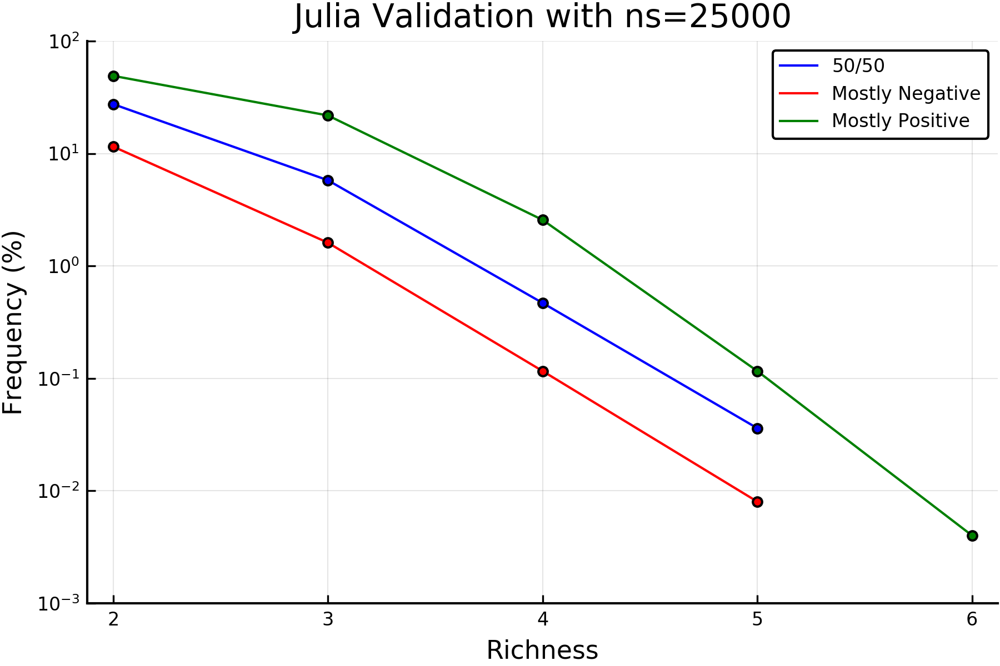
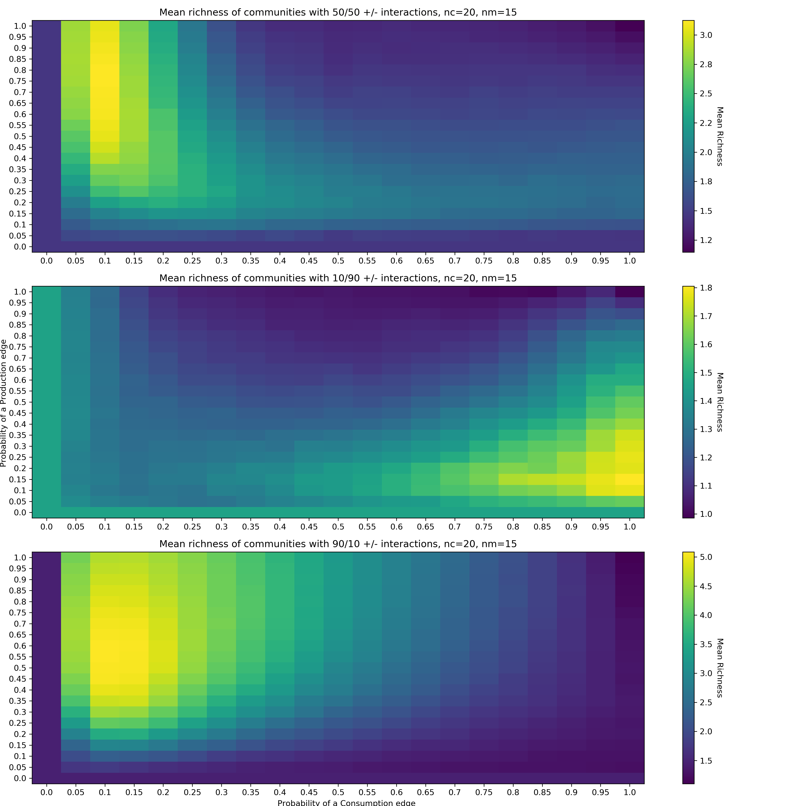
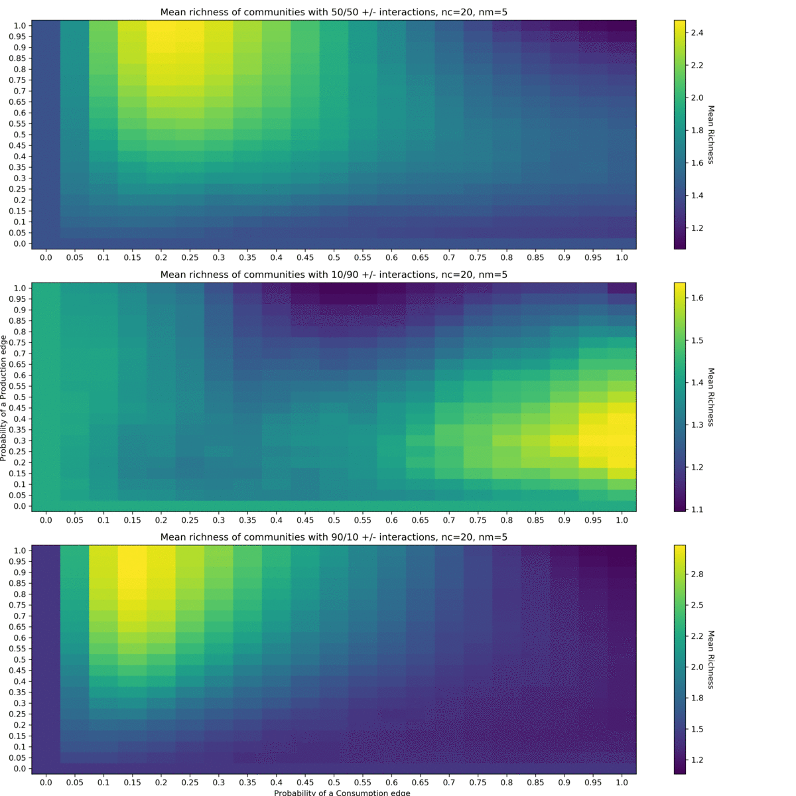
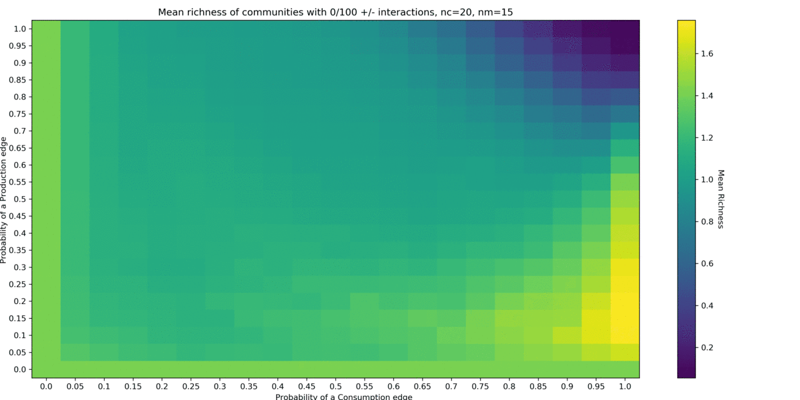
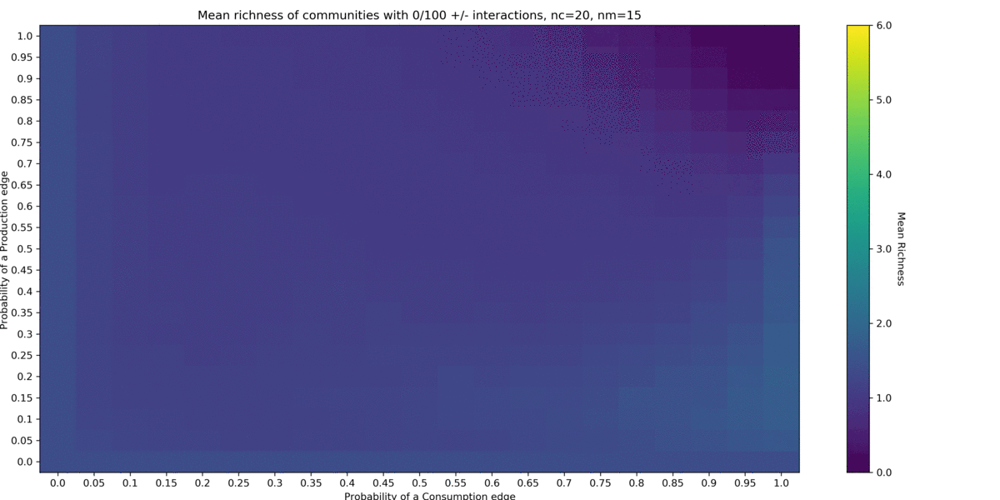

The following manuscript was created using Typora and unfortunately does not conform to Github's rudimentary Markdown syntax. A PDF render is provided, however Markdown is not a typesetting language and its formatting can be less than ideal at times. It is recommended to view the following document either in Typora or equivalent Markdown viewer, or read the PDF. 

# Coexistence-via-Chemical-Interactions: a Case Study in Language and Design Choices, Verification, and New Results

**Authors:**

- Darius Russell Kish1,2
- Yuezhen Chen1
- Jessica Fong Ng1
- Matthew Uy1

(1) *Department of Computer Science, Boston College*

(2) *Department of Biology, Boston College*

### Abstract

------

[TODO]

### Introduction

------

Mathematical modeling of population dynamics is ubiquitous in the sciences. From their applications in the presently relevant field of epidemics to population genetics, chemical kinetics, economics, and systems biology, discrete time-based simulations are used to solve systems of differential equations with no analytical solution. Often these systems are highly dependent on their input parameters and stochastic processes, so multiple replicates of the simulation are used to provide more reliable statistics of the models than one iteration provides.

Discrete time-based simulations are however costly due to difficulties in parallelizing the underlying simulation. While techniques for parallelizing along simulation time have arisen, they are not easily generalized to all problems of this type. The replicates are, however, independent simulations and are a prime example of an Embarrassingly Parallel problem. This allows for linear speedups by number of processors in nearly all cases.

Many of these simulation models are designed and written by scientists without a programming background, and thus suffer from inefficiencies surrounding memory allocation, inefficient re-writing of language-implemented algorithms, avoidance of language-specific features and parallel libraries. For example, many modern languages allow for complex array indexing and operations along its dimensions, which might be overlooked for their conceptually easier but bloated explicit implementations. Design for memory efficiency may be overlooked due to language-specifics and complications surrounding the underlying operations masked by high level syntax. Parallelization is often times overlooked due to its complicated nature at the language-level, especially surrounding Random Number Generators (RNGs). These language features are costly to learn for researchers focused on the conceptual design of these simulations and their results. Thus, many simulation projects that do not employ dedicated software engineers suffer from sub-optimal performance.

We chose a simulation in systems biology from Professor Babak Momeni's lab at Boston College. Its mathematical derivation can be found in *Momeni et al., 2017* and its implementation in Matlab and characterization in *Niehaus et al., 2019,* though we will provide a summary of its background, design, and characteristics here.

Microbial communities naively consist of microbes, small single-celled organisms that can form colonies consisting of cells from the same organism clustered together. While they are widely depicted as isolated colonies on petri dishes, these microbes do no always exist isolated in nature. Communities of microbial species have been found and characterized, sometimes displaying functionality that is not present in its basal components. Understanding the dynamics of microbial communities is vital to harnessing their functionality.

At a very high level, the Well-Mixed model represents a completely homogenous community. All cells can access all mediators in the same concentrations. This is representative of cultures grown in liquid media, which are generally shaken during incubation to ensure constant mixing. This simplifies the model greatly to exclude spatial distribution of species and mediators, needing diffusion constants for both in addition to the inclusion of boundary conditions. Choosing a Well-Mixed approach allows this model to be represented and simulated simply while maintaining relevance to real life scenarios. 

The model can be represented as a graph with two classifications of Nodes, and two classifications of Edges. There are two node types, a species node and a mediator node. The species node has an attribute that tracks the number of cells of the species in the simulation, *S*. A mediator is some non-species component that can be produced or consumed by species. When a species consumes as mediator, it induces either a positive or negative effect on the fitness of the species. A mediator node has an attribute that tracks its concentration, *C*, and *K* corresponding to its saturation level[^ksat]. The two edge types thus represent consumption and production. The production edge has an attribute corresponding to the amount of mediator produced by that species per time, 𝛽. A consumption edge has two attributes, the consumption rate, 𝛼, and its fitness effect, 𝜌.

**Figure 1:** *An example graphical representation of a model. There are three species and two mediators. There are 3 production edges with corresponding **𝛽** values, and two consumption edges with corresponding **𝛼** and **𝜌** values. Edges are shown with direction to show the flow of mediator, though the actual network topology is undirected.* 

These communities can be modeled using relatively simple rules and parameters. In its most simple form, the model is driven by two differential equations:

1. 

2. 

where ***r0*** values are basal growth rates which are then modified by the growth rate kinetic components in the summations. In simplified terms, ***r0*** is the rate at which a species would grow without any outside influence. This base rate is modified both positively and negatively for promotion and inhibition respectively. 

The full model takes into account dilutions and generations, claiming stability is often reached by 200 generations of growth. However, these rules are not represented in the basic equations. Once the total sum of all cells is above the dilution threshhold (experimentally, generally measured using optical density of solution), all cells are diluted proportionally back to an initial value. Species who posessed a greater fraction of total cells before dilution posess the same fraction after dilution. This is done to simulate real dilutions necessary to avoid extended periods of lag phase and cell death seen in experimental incubation without dilutions. Additionally, the formula  is used to calculate the number of generations grown in one round of propogation, where ***dilTh*** is the dilution threshhold in number of cells, and ***nInitCells*** is the number of initial cells, in number of cells. An additional maximum time is imposed in the numerical implementation of 250 hours. If the dilution threshold is not reached by 250 hours, then it is automatically diluted and a new round of propogation is started. 

Though the model is easiest graphically described, it exists in code as a series of matrices. As there are multiple species and mediators, their interactions can be described in an intraction matrix. Concentrations of species and mediators can be defined in their respective vectors. Production and consumption an also be defined in respective matrices. The enabled *Niehaus et al.* to represent equations **1** and **2** in their linear algebraic forms, taking advantage of fast matrix math libraries implemented in many modern languages. 

The simulation consists of two parts: a simulation function, taking as inputs the above matrices and other scalar parameters which then runs through ***nGenerations*** of time, returning the surviving species and their percent compositions; and a simulation harness which generates randomized matrices within certain paramters to be passed to the simulation function. One iteration of the harness serves as one replicate.

### Results

------

##### Design of Original Code

The simulation code was downloaded from the GitHub repository provided in *Niehaus et al., 2019*. It was developed in Matlab and each function was broken out into its own file. A list of functions and their English descriptions are provided below:

* *(Boolean Array[n, m])* Binomial Network Configuration, (***n=nSpecies, m= nMediators,  p***)
  * Generates a ***n*** x ***m*** boolean array used to mask interaction, production and consumption matrices. There is a probability ***p*** that any [i,j] cell becomes populated with a 1, and ***1-p*** that it is a 0. 
* *(Float Array[n, m])* Interaction Matrix Generation, (***n=nSpecies, m=nMediator, ri0, fracPos***)
  * Generates a ***n*** x ***m*** interaction matrix with values between 0 and ***ri0***, with ***1-fracPos*** interactions being negative. 
* *(nExisting[i], compositions[i])* WellMixedSimulation, (*simulation parameters*, see appendix A)
  * Runs a simulation as described above for 200 generations and returns a vector of species that coexist at the end of simulation along with their percent compositions. 
* *Void* Simulation Harness, (***nSamples***, *harness parameters*, see appendix A) 
  * Generates inputs for ***nSamples*** simulations and runs them, tracking results and input parameters in arrays for further analysis. The resultant simulation data is serialized on disk for archiving and later analysis.

##### Motivations for Shift in Language

Although the paper was published in an open access journal, Matlab is not an open source language. Many institutions maintain Matlab licenses, however costs for commercial and non-academic associated individuals is inhibitory when viable open source languages exist. Matlab additionally is not community developed, thus features available in other languages that may be beneficial to expansions of the model may not be feasibly implemented in Matlab. 

An immediate example is sampling the initial species distributions from a non-uniform distribution. A proposed distribution for this task is the Dirichlet distribution, as it can be used to solve a string-cutting problem. In the string cutting problem, we want to cut a string into "***K*** pieces with different lengths, where each piece had a designated average length, but allowing some variation in the relative sizes of the pieces".[^stringcutting] Such a distribution of solutions to this problem can be generated by the Dirichlet distribution. This problem is directly applicatble to initial distributions, where we have a set amount of initial cells which we want to assign to the species with average proportion while still allowing for variation. We can, for example, bias species one to on average start as 50% of the initial composition, or have average uniform starting compositions with intersample variations. In Python and Julia, this distribution is avaible in the Numpy and Distributions packages respectively, which are well defined and developed packages that have gone through extensive testing. In Matlab, the Dirichlet distribution is not included in its native distributions, and instead an untested solution exists as a snippet in an online blog post.[^matlabdrchrnd] The lack of this feature through a well-vetted library can make finding an implementation difficult for a novice programmer and erode confidence in its implementation, since a novice programmer might lack the knowledge to test the unknown implementation. 

##### Choosing a New Target Language

 We explored multiple languages used in the scientific community to discern a viable new target language to port the existing code into. Our criteria were ease of syntax, well optimized high level operations, and fast matrix math. We wished to maintain the performance and ease of use for non-programmers of Matlab but in an open source language. This excluded C, C++, and FORTRAN despite their performance. Additionally, these languages lack reliable features for easy parallelization. A study by Jules Kouatchou published in NASA's *Modeling Guru* resource compares performance of common scientific languages in various scientific tasks from the framework of a novice programmer. It is unclear how many replicates were performed to eliminate random noise in execution time, however results were generally clear enough to guide our decisions. The results thus are not representative of highly optimized code in the language, rather general code that can be expected of a non-programmer researcher. We are primarily interested in results of matrix operations, since this is the major operation in the model. A excerpt summary of results are provided below:

* Array Copies

  |      Language      | n=5000 | n=9000 |
  | :----------------: | :----: | :----: |
  |   Python + Numba   |  0.26  |  0.34  |
  |       Julia        | 0.0907 | 0.2274 |
  |       Matlab       | 0.2787 | 0.8437 |
  |         R          | 19.750 | 63.820 |
  | Fortan + ifort -O3 | 0.0680 | 0.2120 |

* Matrix Multiplication[^pythonnumba]

  |    Language    | n=5000 | n=9000 |
  | :------------: | :----: | :----: |
  | Python + Numba |  3.64  | 13.57  |
  |     Julia      | 0.1494 | 0.3497 |
  |     Matlab     | 0.9567 | 0.2943 |
  |       R        | 0.920  | 0.951  |
  | Fortan + DGEMM | 0.2120 | 0.3320 |

From these results, we see that Matlab is a very efficient language for its ease of use, explaining its strong foothold in the scientific community. R consistenly performs poorly and was eliminated. Although Python with Numba compilation provides generally good performance while maintaining access to the general purpose programming features of Python, it is outperformed by the language Julia in matrix math tasks. Julia additionally has intrinsic profiling tools to easily improve code performance. A comparison of available libraries for Python and Julia showed that for the scope of this model, Julia contained equivalents of Python libraries that would commonly be used to improve non-math aspects of the model. 

While Python is a massively popular open source language with broad scope, this model inherently does not need to take advantage of many features present in Python. To optimize use of the model from a user standpoint, we identify useful feautures: serialization of variables to archive data for later use; configuration of input parameters from outside files; and visualization packages in the target language. These features can be achieved through the Serialization or JLD modules, JSON, and PyPlot modules in Julia respectively. Additionally, Julia is supported with Jupyter notebooks, allowing for equivalent usage in data analysis as Python. PyPlot is a wrapper of Python's PyPlot module, allowing equivalent usage. As the necessary features are present in both languages, Julia's impressive performance in the ciritcal sections drove out decision. Julia's syntax is a mix of Python and Matlab style syntax and is easy to pick up coming from eaither language. 

Julia additionally features directives for multi-processor parallelization that are easier to utilize than Python's multiprocessing when no inter-process communication is necessary. Where in Matlab a *parfor* loop may be utilized, an equivalent *@distributed for* directive may be used in Julia when iterations of the for loop are independent, as they are in the model harness. RNGs can safely be utilized on each process through an array of Mersenne Twister RNGs that are jumped forward 1020 steps from each other. This is similar to a process used in NumPy to achieve the an array of independent RNGs. The safe parallelization with easy syntax further solidified the decision to use Julia. 

##### Improvements to the Model Implementation

As described above, the base structure of the model was kept the same, including its representation in matrices to achiever higher performance than abstract graphical representations. The harness was changed to allow passing of model parameters via configuration files. This prevents changes to hardcoded values in source code by users and instead facilitates interaction through safer configuration files. We have also updated the harness to use multi-processor parallelization and updated the RNG the appropriate parallel-safe method described above. Simulation variables are saved using JLD, which can then be reloaded into a key,value dictionary at a later time. We have included in the *figures* folder a Jupyter notebook showing the use of JLD and PyPlot modules to load a simulation output, analyze its results and generate complex figures. 

The simulation code itself was majorly updated using guidance from the *@time* macro. Its direct port from Matlab showed that memory optimizations performed by Matlab were not performed by Julia, and calls to the simulation often involved upwards of 10 GB of memory allocations per call. This is indicative of repetitive creation of temporary variables to store intermediate results of complex expressions. It appears that Matlab breaks expressions into base components and allocates temporary variables outside of the loop with in-place operations to only allocate this memory once. Julia does not do this automatically, so manual breaking up expressions combined with creation of temporary variables outside of the loop and syntax hints for in-place operations were used to achieve similar performance. This did not change the expressions or logic used in the original implementation, in other words its high-level semantics, however it did change the syntax to match its low-level semtantcis to those of Matlab. 

##### Performance Improvements in Julia

Moving the model into Julia with performance modifications and parallelization has lead to great improvements over its initial Matlab implementation. We recognize proper benchmarking of such a complicated model would be a long and arduous process, so the improvements noted here are anectdotal and a product of analysis of validation and further data collection jobs. We can, however, provide analysis of the code and language design to back our initial findings. 

Julia's *Distributed* module is largely similar to Python's *Multiprocessing* module in terms of API, though the *@distributed* macro behaves closer to Matlabs *parfor* syntax. Julia approaches multiprocess parallelization by abstractly managing a cluster of worker processes, to which the main process submits jobs. While the mechanics and return values of interfacing with *Distributed* are beyond the scope of this paper, the *@sync @distributed* macro is straightforward.[^sync] This macro partitions the iterations of the loop to worker processes and the cluster waits for all iterations to complete before moving on in the program. Special array data types called *SharedArrays* prevent local copies of each simulation variable tracking array on each worker, and instead they write to the *SharedArray* on the main process. There is no memory access to these arrays, only writes which are guaranteed to not overlap, so there is no waiting for memory locks. As this is a facile case for such a system, where no locks or inter-process communication is needed, it sees nearly linear speedup with each additional processor. 

All results presented below were run on Boston College's Research Cluster using either 28 or 40 CPU nodes containing Intel Xeon E5-2680 v4 and Intel Xeon Gold 6148 processors respectively, both at 2.40 GHz running Red Hat Enterprise Linux. In the original, linear Matlab version, the Stability Screen used to generate Figure 2b in *Niehaus et al., 2019* took approximately 8 hours and 15 minutes to complete 5000 samples. A parallelized version using Matlab's *parfor* loop used approximately 26 minutes wall time with 40 processors to complete 5000 samples, which is roughly  17 hours and 20 minutes of computational time. In Julia, however, the parallelized model for validation of *Niehaus et al.'s* Figure 2b was achieved in 22 minutes wall time using 28 processors to complete 5000 samples. This is roughly 10 hours and 15 minutes of computational time. No linear Julia model was developed, however this is anecdotally an over 1.5x improvement over Matlab. 

##### Verification of the Model

To verify that the model performs equivalently to the Matlab variant, Figure 2b of *Niehaus et al., 2019* was chosen to be replicated. For this, simulation parameters provided in Appendix [B] nearly identical to those used in the original study were used. The proportions of number of species coexisting at the end of simulation were calculated for three interaction matrix parameters: 50/50 positive/negative interactions, 10/90 positive/negative interations, and 90/10 positive/negative interactions, corresponding to the ***fracPos*** variable in interaction matrix generation. 

**Figure 2:** *Richness is defined as the number of coexisting species at the end of the simulation. Mostly positive (90/10) interaction matrices showed greater frequency of coexistence (richness > 1) than 50/50 interactions, whose frequency of coexistence is greater than mostly negative (10/90) interactions. For non-trivial cases where lines overlap, integrating under the curve using a Left-Riemann sum will give definitive coexistence frequencies.* 

The result of this simulations (Figure 2) strongly agrees with the results presented in *Niehaus et al., 2019*. Both overall shape of the frequency graph and the order of interaction matrices with their relative frequencies matches previous results. From these data we were confident our model is equivalent in behavior to that developed by *Niehaus et al.* and we could proceed with new analyses. 

##### Screening Consumption and Production Network Parameters

Facilitation and inhibition are driven by consumption edges in the model. When a species consumes a mediator, it has either a positive or negative effect on its growth rate, which is the deciding factor for species survival in the model. When a mediator is consumed, its concentration in solution is reduced until it is fully depleted. This is countered by production of consumers by Species, so the consumption and production of mediators is vital to dynamics that influence final composition. Production and consumption is driven by the underlying graph determining which species produce which mediators, and which consume which mediators. The simulation parameters for these two networks are ***qc*** and ***qp*** for probability of a consumer edge and probability of a producer edge respectively. This can be considered as binomial construction of edges with probability ***qc*** or ***qp*** between two colors of nodes, ensuring the resultant graph is bipartite.[^bipartite]

**Optimal** *qp* **and ** *qc* **Values are Dependent on the Number of Mediators**

The values of ***qc*** and ***qp*** were theorized to be important to the final richness of the community, as they have direct effects on growth rates of the species, and the presence of interaction edges. To gain a broad overview of their effects on richness, a screen of ***qc*** and ***qp*** ranging from 0 to 1 was conducted. Other simulation parameters similar to the stability screen used for validation. 

**Figure 3:** *When the number of Mediators is 15, the three interaction matrix paradigms display different optimal values for network configuration. In the mostly negative (10/90 +/-) interaction case, optimal values for consumption (**qc**) are clustered between 0.9 and 1, and for production (**qp**) between 0.1 and 0.3, with the maximal richness value of approximately 1.8 species occurring when **qc**=1 and **qp**=0.15. In the 50/50 +/- case the cluster of optimal values has shifted, with consumption between 0.05 and 0.15, and production between 0.45 and 1, with the maximum richness value of approximately 3 species occurring when **qc**=0.1 and **qp**=[0.6, 1]. In the case of mostly positive (90/10 +/-) interactions, a cluster similar to the 50/50 case is seen, however the maximum richness value of approximate 5 species is found when **qc**=0.[0.1, 15] and **qp**=[0.45, 0.7]. Heatmaps of the standard deviation and median values are available in the supplementary information.*  

A general trend across all cases is as the fraction of positive interactions increases, the mean richness increases across all ***qc*** and ***qp*** values (Figure 3). In the mostly negative case, the maximum achieved richness was under 2 species, where in the mostly positive case at least two thirds of all ***qc*** and ***qp*** values exhibited richness of 2 or larger. This suggests, as seen in Figure 2 as well, that richness is influenced by the fraction of positive to negative interactions regardless of the underlying consumption and production network.

The optimal values noted in Figure 3 differed slightly than previous unpublished results from the Momeni Lab. It was noted that their prior results were based on a simulation using 10 mediators, whereas our initial screen used 15 mediators. To elucidate the effect of the number mediators on the optimal ***qc*** and ***qp*** values, the number of mediators was screened from 5 to 20 mediators. This screen reveals an interaction between the number of mediators present in the simulation and the underlying production and consumption networks (Figure 4). There are different optimal network values for different numbers of mediators. 

**Figure 4:** *Animated heat maps of probability of production edge (**qp**) and probability of consumption edge (**qc**) screens across changing number of mediators. Two general trends are noticed across all three interaction types. First, the drop-off of optimal values becomes steeper as the number of mediators is increased. This is seen as higher contrast between the yellow and blue (high and low) representations with increasingly fewer middle values. The second trend is a shift in the 50/50 +/- interaction cases from cluster around **qc**=0.2, **qp**=1 down and left to **qc**=[0.05, 0.1] **qp**=[0.5, 1]. In the 90/10 +/- case the range of optimal **qp** is narrowed to [0.4, 0.55]. For the mostly negative 10/90 +/- case, optimal **qc**=1 remained constant, though **qp** shifts from 0.3 to 0.1.* 

Biologically, there is not a clear explanation for these results. Since the simulation trials are independent of each other, a wide variety of interaction values and topologies are tested. Changing the number of mediators available likely has complex but systematic affects on the availability of interactions that influence growth rate. Communities likely assemble in order to maximize their positive interactions while minimizing negative interactions between species, and the shifts seen suggest the number of mediators has an affect on this balance. The number of mediators in the simulation affects the ideal network topologies for production, consumption, and interaction through an unknown mechanism. 

**Optimal** *qp* **and ** *qc* **Values are Different for Competitive and Cooperative Communities**

As suggested above, coexisting communities are theorized to maximize their positive interactions while minimizing negative interactions. The percentage of positive to negative interactions seen *overall* in the simulation is dictated by the ***nFracPos*** variable. In Figures 3 and 4, values of 0.1, 0.5, and 0.9 were tested, however their results suggest significant movements in the region of ***nFracPos***=[0, 0.5]. Values in the range of 0 to 1 in steps of 0.5 were screened to elucidate these movements. 

**Figure 5:** *Animated heat maps of probability of production edge (**qp**) and probability of consumption edge (**qc**) screens across changing fraction of positive interaction in the interaction matrix. As shown in Figure 3, the mostly negative case (10/90 +/-) exhibited different clustering than the 50/50 and mostly positive case (90/10 +/-). This screen across the fraction of positive interactions reveals the shift in optimal **qp** and **qc** values for different community paradigms. In the top image, the heat map is normalized at every frame, whereas in the second image the scale is kept constant.* 

In the normalized heat maps a clear shift from the high consumption and low production cluster in mostly negative interactions to the low consumption and median to high production cluster in ***nFracPos*** >= 0.3 can be seen. This is however not present in the constant scale heat maps, and instead an emergence of the low consumption and median to high production cluster from across the board low richness is seen. 

In the normalized heat map when ***nFracPos*** = 0.3, the maximum richness value is slightly above 2, however it is found in approximately the same location on the optimal ***qp, qc*** cluster as increasing ***nFracPos*** values. When ***nFracPos*** = 1, the maximum richness value is nearly 6, suggesting the optimal ***qp, qc*** values do not change significantly above ***nFracPos*** = 0.3, but ***nFracPos*** increasingly boosts the richness seen at these optimal values network values. 

The normalized heat maps are also useful for gaining insight into the balance of the two clusters across ***nFracPos*** values. Communities can be thought of in two modalities: competitive and cooperative. In a competitive community, species have mostly negative effects on each other's fitness, whereas a positive community has mostly positive effects on fitness. When ***nFracPos*** is low, it represents competitive communities as there are mostly negative interactions occurring. In these cases, the heat maps suggest that high consumption and low production values are optimal. For high ***nFracPos*** values, it appears low consumption and a wider range of production values from 0.5 to 1 are optimal. As seen above, the data suggest a cutoff of 30% positive interactions for communities to shift from competitive network topology to cooperative network topology. In other words, cooperative communities begin to form when there are at least 30% positive interactions. The differing but sustained regions of optimal network topology between modalities suggest a fundamental difference between the mechanisms that cooperative and competitive communities form stability. 

### Discussion

------

### Methods

------

### Data Availability

------

All data are available upon request. All JLD files were generated with Julia version 1.4.0 (2020-03-21) with JLD version 0.9.2. It cannot be guaranteed that newer or older releases of either Julia or JLD will be compatible with these save files. If major changes to the availability of Julia v1.4.0 or JLD v0.9.2 become known, we will do our best to migrate the save files to a different, more available format. 

### Code Availability

------

### Acknowledgements

The original mathematical model was conceived by Wenying Shou and Babak Momeni and implemented in Matlab by Minghao Liu and B.M. 

------

### Author Information

**Affiliations**

*Department of Computer Science, Boston College, Chestnut Hill, MA, 02467*, USA

Darius Russell Kish, Yuezhen Chen, Jessica Fong Ng, Matthew Uy

*Department of Biology, Boston College, Chestnut Hill, MA, 02467*, USA

Darius Russell Kish

**Contributions**

Implementation in Julia was written by D.R.K. Simulations and data analyses were conceived by D.R.K. and Babak Momeni, and run by D.R.K. D.R.K. wrote the manuscript and [TODO]

**Corresponding Author**

Correspondence to [Darius Russell Kish](mailto:russeldk@bc.edu). 

------

### Appendices

------

### Supplementary Information

------

### References

[^ksat]: This is perhaps the most challenging aspect of this model to understand for non-biologists as it relates to cell growth kinetics. For the case of inhibition, the model uses the formula: , where  is the corresponding *k* value in ***K***. The amplitude of effect on growth rate is controlled by ***K*** for inhibition. For positive interactions, or facilitation, the model uses  , a form of the Monod equation. Here, *k* determines at what concentration of C that  will be reached, and  is the saturated effect on the growth constant by the mediator. These equations are determined from experimental data studying growth curves. For more information see *Merchuk and Asenjo, 1995* and *Konak, 1974.* 

[^stringcutting]: https://en.wikipedia.org/wiki/Dirichlet_distribution#String_cutting
[^matlabdrchrnd]: https://cxwangyi.wordpress.com/2009/03/18/to-generate-random-numbers-from-a-dirichlet-distribution/
[^pythonnumba]: It is mentioned that a loop is used for multiplication in the Python+Numba benchmark, which appears not to be optimized into very efficient BLAS or LAPACK calls, accounting for this poor performance. This, however, may be indicative that it is not easy to invoke calls to these underlying libraries from Numba as a novice programmer. Their existance may also not be known, and thus not searched for when unexpected poor performance in encountered. 
[^sync]: The *@sync* macro further abstracts Julia's *Distributed* design from the user by waiting for all iterations of the for loop to complete before moving on. In our case we care that the full loop is finished before serializing the results to disk. Without this there is a possibility that the results are incomplete in to the User. It has no substantial penalty on speedup. 
[^bipartite]: The resulting production and consumption networks are necessarily bipartite since a species does not produce or consume directly to or from another species, and mediators do not produce and consume to or from other mediators. Edges only exist between mediators and species, two differently colored nodes. This is the definition of bipartite.